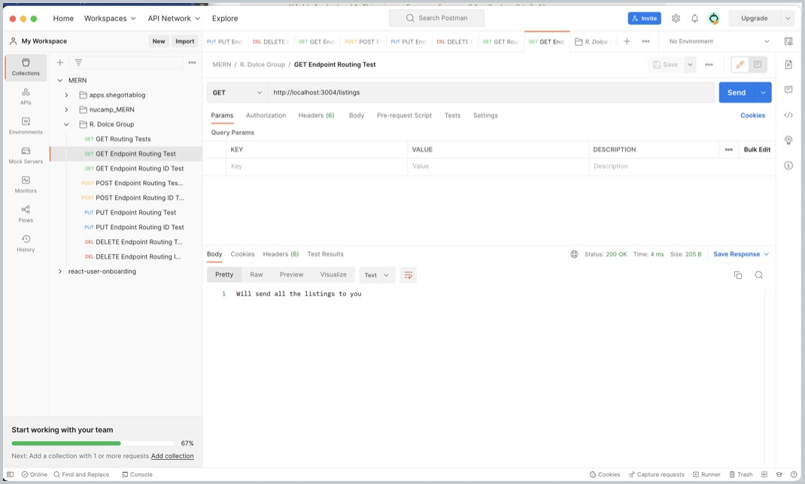
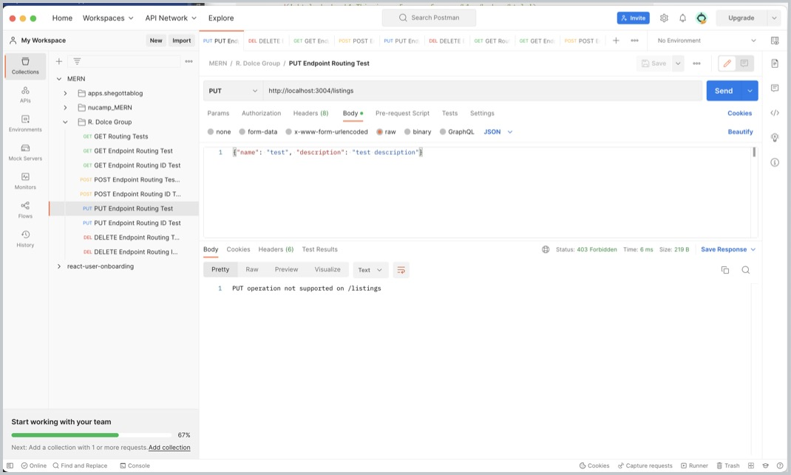
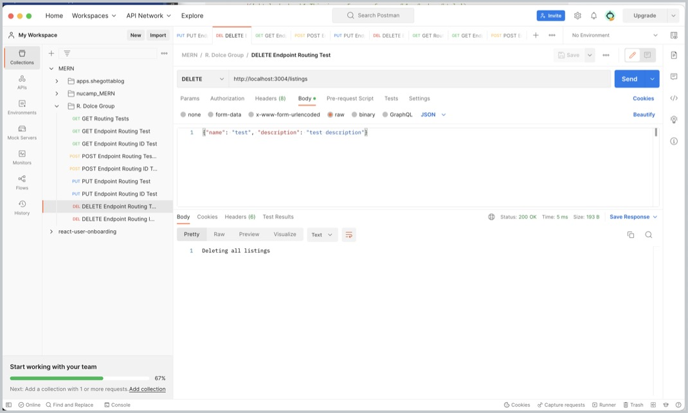
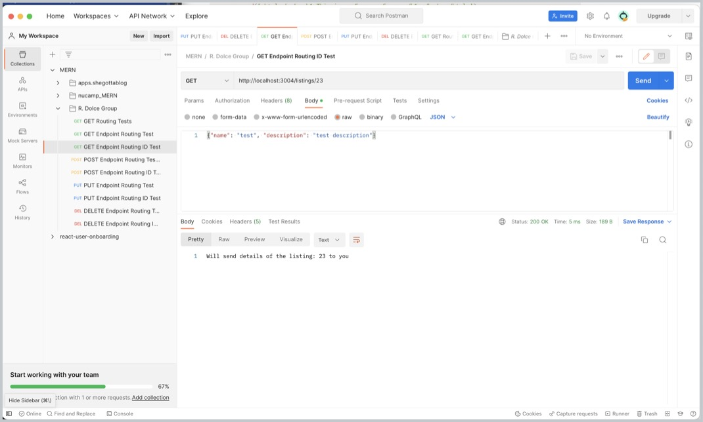
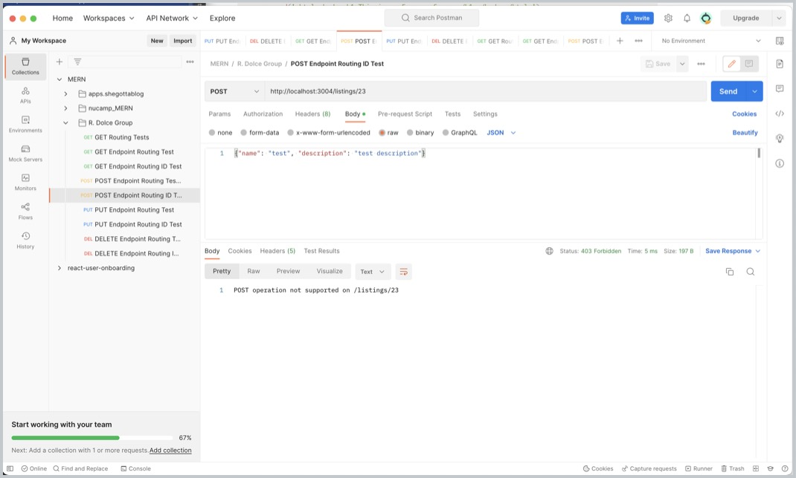
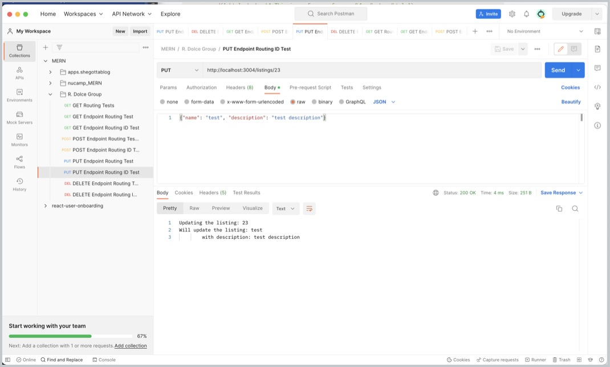
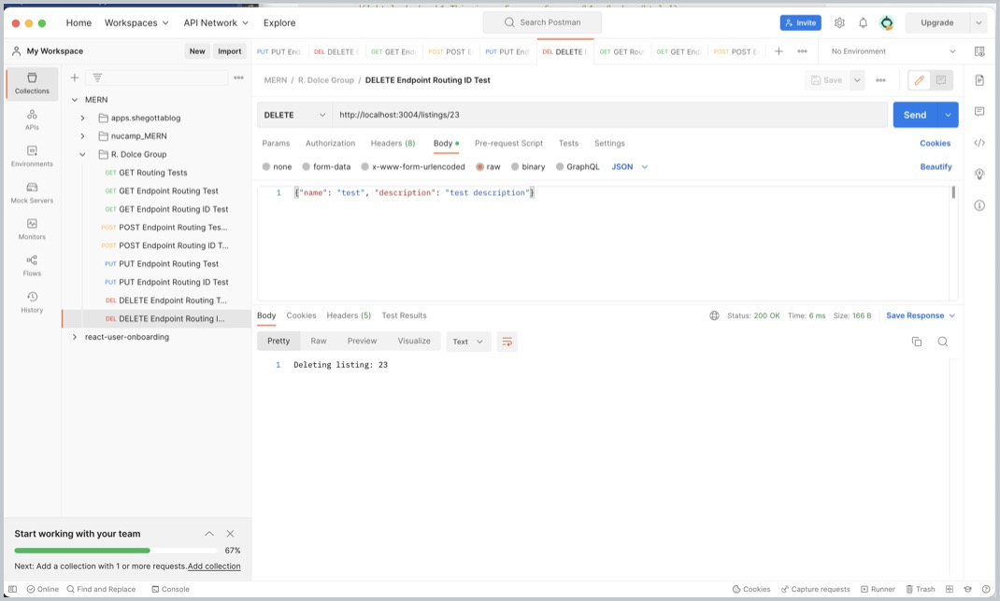

# M.Dolce R. Dolce Group Vacation Rental Listings Demo
- Version 1.0.0
- Last Updated January 11, 2023
- Author: marti@rdolcegroup.com
- Timeline to completion: 20 days
---
Creating a simple MERN Vacation Listings project demonstrating technologies used to build portfolios of technologies learned while attending Nucamp Bootcamp.
When developing this application there were a variety of source codes, tutorials, books and web articles analyzed to explore the most effective way for development of this application on a short scale.

## Express Generator Server Environment
A list of packages used for the backend server environment.

| Package             | Description                                     |
|---------------------|-------------------------------------------------|
| `express-generator` | https://expressjs.com/en/starter/generator.html |
| `https`             |                                                 |
| `body-parser`       | https://www.npmjs.com/package/body-parser       |
| `cookie-parser`     | https://www.npmjs.com/package/cookie-parser     |
| `CORS`              | https://www.npmjs.com/package/cors              |
| `express`           | https://www.npmjs.com/package/express           |
| `mongodb`           | https://www.npmjs.com/package/mongodb           |
| `mongoose`          | https://www.npmjs.com/package/mongoose          |
| `morgan`            | https://www.npmjs.com/package/morgan            |
| `nodemon`           | https://www.npmjs.com/package/nodemon           |

---
## Express Server Features
Map: x = done p = in process r = researching

[x] - Express Server with Routing and Middleware 01.14.23

[x] - Integrating MongoDB

[x] - Adding Middleware

[p] - Adding Authentication & private routing

[i] - Integrating client-server front-end

[i] - Adding controllers

[i] - Adding routes

---
## POSTMAN REST API Testing (GET | POST | PUT | DELETE)

The following are screen examples demonstrating the functionality of Express and the built-in express.json() routing features.

| GET                                                                        | POST                                                                       | PUT                                                                        | DELETE                                                                     |
|----------------------------------------------------------------------------|----------------------------------------------------------------------------|----------------------------------------------------------------------------|----------------------------------------------------------------------------|
|  |  |  |  |
|  |  |  |  | 

## Resources & Inspiration

 
Functional Concepts

> React Navigation | https://reactnavigation.org/docs/getting-started/

> Gatsby plugin for react-native-web | https://www.gatsbyjs.com/plugins/gatsby-plugin-react-native-web/#gatsby-plugin-for-react-native-web

> Const vs Function | https://dev.to/ugglr/react-functional-components-const-vs-function-2kj9

> Logging in Express JS using winston and morgan | https://lioncoding.com/logging-in-express-js-using-winston-and-morgan/

> Postman | https://www.postman.com/downloads/

 
Design & UI

> Material Design Icons | https://materialdesignicons.com/

> Adobe Express to create SVG | https://www.adobe.com/express/

